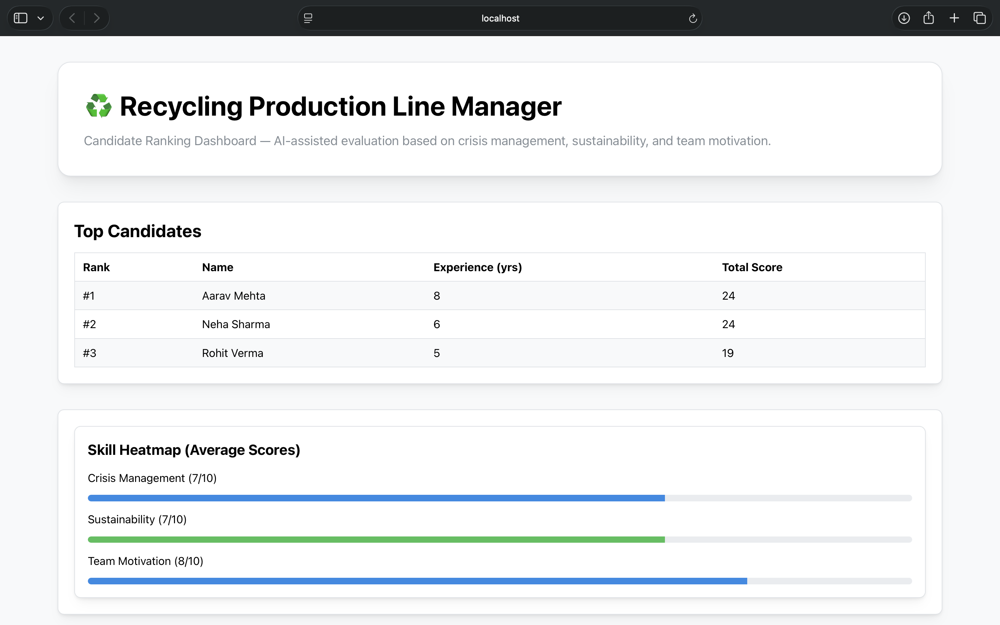
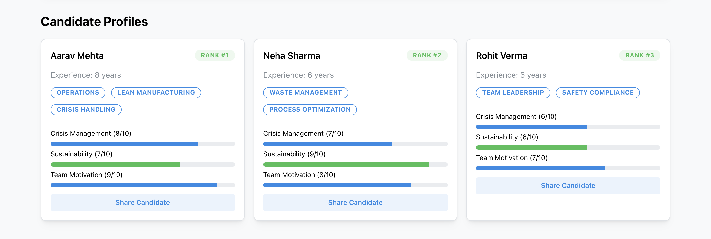

# Recycling Candidate Ranking System 
This project is a minimal, standalone system for ranking candidates for a **Recycling Production Line Manager** role.  

It demonstrates **database design**, **AI prompting**, **data generation**, and a **functional dashboard**.



---

## 🧩 Project Overview

The system evaluates candidates across three independent competencies:
- Crisis Management
- Sustainability Knowledge
- Team Motivation

Each competency is scored independently (1-10), aggregated into a total score, and used to rank candidates.

The dashboard visualizes:
- A leaderboard of top candidates
- A skill heatmap (average scores)
- Detailed candidate profile cards

---

## 🛠 Tech Stack

- **Frontend:** React + Vite + TypeScript  
- **UI Library:** Mantine  
- **Database:** SQL (MySQL compatible) 
- **Data Generation:** Node.js + Faker.js  
- **AI Evaluation:** Prompt-based (mock or real AI supported)

---

## 📁 Repository Structure

recycling-candidate-ranking/
├── frontend/              # React + Vite dashboard
├── database/              # SQL schema and seed data
├── scripts/               # Faker-based data generation
├── ai-prompts/            # AI evaluation prompts
├── screenshots/           # Dashboard screenshots
└── README.md


---

## 🗄 Database Design

The database consists of three tables:
- `candidates` — core profile data (name, experience, skills)
- `evaluations` — AI-generated scores per competency
- `rankings` — final rank derived from total score

Design principles:
- Skills stored as JSON (aligns with frontend data model)
- Scores constrained to a 1–10 range
- Rankings separated for clarity and extensibility
- Indexes added for efficient leaderboard queries

Files:
- `database/schema.sql`
- `database/seed.sql`

---

## 🔁 Data Generation (Faker)

A Faker-based script generates **40 realistic candidates** with:
- Names and experience
- Skills from a predefined pool
- Evaluation scores
- Deterministic ranking based on total score

Scripts:
- `scripts/generateCandidates.js` → JSON output
- `scripts/generateCandidatesSql.js` → SQL seed data

These scripts ensure the **data pipeline matches the DB schema and frontend types exactly**.

---

## 🤖 AI Prompting Approach

Three independent prompts are used:
1. Crisis Management
2. Sustainability Knowledge
3. Team Motivation

Each prompt:
- Evaluates one competency only
- Uses a clear 1–10 scoring rubric
- Returns a deterministic JSON output

Scores are aggregated **outside** the AI to improve:
- Explainability
- Bias reduction
- Flexibility in weighting

Prompts are documented in:
- `ai-prompts/README.md`

Mock AI responses are supported and sufficient for this assignment.

---

## 📊 Dashboard Features
The React dashboard includes:
- **Leaderboard** — ranked list of candidates
- **Skill Heatmap** — average competency scores
- **Candidate Cards** — detailed profiles with visual score indicators

The UI is intentionally minimal and readable, optimized for quick reviewer evaluation.

---

## Running the Frontend Locally

```bash
cd frontend
npm install
npm run dev
```


## Screenshots





